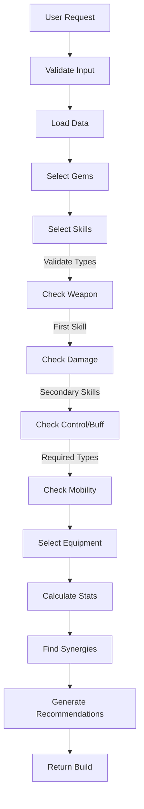

# Build Generation Implementation Plan

## Overview

This document outlines the implementation plan for DIBO's build generation system. The system will generate optimized character builds based on user preferences, game mechanics, and optionally their existing inventory.

## Current Implementation Status

### Implemented Components:

1. API Structure:
   - `/builds/generate` endpoint defined
   - Request/response models
   - Basic service structure

2. Data Management:
   - Data loading system
   - File validation
   - Data structure verification

3. Core Features:
   - Basic gem selection algorithm
   - Inventory validation
   - GitHub Gist integration
   - Advanced essence scoring system
   - Build type specific scoring
   - Percentage bonus handling
   - Attack speed modifiers
   - Weapon skill validation
   - Mobility skill validation
   - Control/buff validation

### Missing/Incomplete Components:

1. Core Selection Algorithms:
   - `_select_equipment`: Equipment selection system
   - `_calculate_stats`: Stats aggregation
   - `_find_synergies`: Synergy detection

2. Analysis Systems:
   - Equipment optimization
   - Set piece combinations
   - Build recommendations

### Implementation Status:

```
✅ Complete
- Data loading and validation
- Basic gem selection
- Skill type validation
- Essence scoring
- Build type scoring
- Percentage bonus handling
- Attack speed modifiers
- Weapon skill validation
- Mobility skill validation
- Control/buff validation

🔄 In Progress
- Equipment selection
- Set bonus evaluation
- Stats calculation
- Synergy detection

❌ Not Started
- Equipment optimization
- Set piece combinations
- Final build recommendations
```

## Core Components

### 1. Build Generation Pipeline



### 2. Data Models

#### Request Model
```python
class BuildRequest:
    build_type: BuildType      # raid, pve, pvp, farm
    focus: BuildFocus         # dps, survival, buff
    character_class: str      # e.g., "barbarian"
    inventory: Optional[Dict] = None
```

#### Skill Model
```python
class Skill:
    name: str
    base_type: str           # weapon, damage, control, buff, dash
    second_base_type: Optional[str]
    base_cooldown: str
    description: str
```

#### Class Constraints
```python
class ClassConstraints:
    skill_slots: Dict[str, List[str]]  # available_skills
    weapon_slots: Dict[str, List[str]]  # available_weapons
```

## Implementation Phases

### Phase 1: Core Selection Algorithms

1. Skill Selection (`_select_skills`)
   - Input: build type, focus, selected gems
   - Algorithm:
     1. Filter skills by character class
     2. Score each skill based on:
        - Base effectiveness for build type
        - Synergy with selected gems
        - Focus alignment (e.g., DPS vs Survival)
        - Percentage-based improvements
        - Attack speed modifiers
     3. Select optimal skill combination
     4. Validate against class constraints
     5. Verify control/buff requirements

2. Equipment Selection (`_select_equipment`)
   - Input: build type, focus, gems, skills
   - Algorithm:
     1. Score equipment pieces based on:
        - Base stats alignment with focus
        - Synergies with gems and skills
        - Set bonuses potential
     2. Optimize set combinations
     3. Fill remaining slots with best-in-slot items

### Phase 2: Stats and Synergies

1. Stats Calculation (`_calculate_stats`)
   - Implement stat aggregation from:
     - Base stats
     - Gem bonuses
     - Equipment bonuses
     - Set bonuses
     - Skill modifiers
   - Calculate derived stats:
     - DPS metrics
     - Survival metrics
     - Utility metrics

2. Synergy Analysis (`_find_synergies`)
   - Implement synergy detection:
     - Gem-to-gem synergies
     - Gem-to-skill synergies
     - Skill-to-skill synergies
     - Equipment set synergies
   - Score synergy effectiveness
   - Identify anti-synergies

### Phase 3: Scoring Systems

1. Skill Scoring (`_calculate_skill_score`) 
   - Base score calculation based on skill type and build focus
   - Focus multiplier for build type alignment
   - Gem synergy bonus calculation
   - Cooldown impact consideration
   - Type-specific bonuses (control, mobility)
   - Percentage-based effect bonuses
   - Attack speed modifier bonuses
   - RAID-specific optimizations

2. Equipment Scoring (`_calculate_equipment_score`)
   ```python
   def _calculate_equipment_score(item, build, focus):
       stat_score = score_stats_alignment(item, focus)
       synergy_score = score_synergies(item, build)
       set_potential = evaluate_set_potential(item)
       return (stat_score * 0.4 + 
               synergy_score * 0.4 + 
               set_potential * 0.2)
   ```

3. Set Scoring (`_calculate_set_score`)
   ```python
   def _calculate_set_score(set_name, build):
       bonus_score = score_set_bonuses(set_name, build)
       synergy_score = score_set_synergies(set_name, build)
       return (bonus_score * 0.6 + synergy_score * 0.4)
   ```

### Phase 4: Optimization and Constraints

1. Build Constraints
   - Implement constraint checking:
     - Skill slot limits
     - Gem star rating compatibility
     - Equipment slot restrictions
     - Set piece combinations
     - Control/buff requirements
     - Mobility skill requirements

2. Build Optimization
   - Implement optimization strategies:
     - Set piece combination optimization
     - Gem slot allocation optimization
     - Skill loadout optimization
     - Equipment stat priority optimization
     - Build type specific optimizations
     - Percentage bonus maximization

### Phase 5: Inventory Integration

1. Inventory Adaptation
   - Modify selection algorithms to consider:
     - Available gems and their ranks
     - Available equipment pieces
     - Existing set combinations
     - Current skill loadout

2. Inventory Optimization
   - Implement inventory-aware optimization:
     - Maximize use of existing high-value items
     - Suggest minimal changes for improvement
     - Consider upgrade paths
     - Balance immediate vs long-term goals

## Implementation Details

### 1. Skill Selection System

#### Current Implementation (2025-01-04)
The skill selection system now properly validates:

1. Weapon Skills:
   - First skill must be a weapon skill
   - Uses weapon_slots from class constraints
   - Validates against available weapons

2. Secondary Skills:
   - Must be from available_skills list
   - Validates skill types:
     - At least one damage skill
     - At least one control or buff skill
     - At least one mobility skill (dash)

3. Data Structure:
   - Uses class-specific constraints
   - Properly structured skill registry
   - Includes skill type metadata

#### Next Steps
1. Equipment Selection:
   - Implement base equipment scoring
   - Add set bonus evaluation
   - Consider skill synergies

2. Stats Calculation:
   - Aggregate stats from all sources
   - Apply percentage modifiers
   - Calculate final values

3. Synergy Detection:
   - Implement skill-to-skill synergies
   - Add equipment-to-skill synergies
   - Consider gem interactions

## Testing Strategy

### Unit Tests
- ✅ Skill validation
- ✅ Essence scoring
- ✅ Gem selection
- 🔄 Equipment selection
- ❌ Stats calculation
- ❌ Synergy detection

### Integration Tests
- 🔄 Full build generation
- ❌ Equipment optimization
- ❌ Set combinations

### Performance Tests
- ❌ Large inventory handling
- ❌ Complex build scenarios
- ❌ Multiple concurrent requests

## Timeline

1. Week 1 (Current):
   - ✅ Complete skill validation
   - ✅ Fix essence scoring
   - 🔄 Start equipment selection

2. Week 2:
   - Equipment scoring system
   - Set bonus evaluation
   - Basic stats calculation

3. Week 3:
   - Synergy detection
   - Performance optimization
   - Documentation updates

## Next Steps

1. Fix remaining skill validation issues:
   - Improve control/buff skill detection
   - Fix integration test failures
   - Add more test coverage for edge cases

2. Begin equipment selection implementation:
   - Design scoring system for equipment
   - Implement set bonus evaluation
   - Add inventory integration

3. Enhance build optimization:
   - Add more build type specific logic
   - Implement advanced synergy detection
   - Improve recommendation generation
